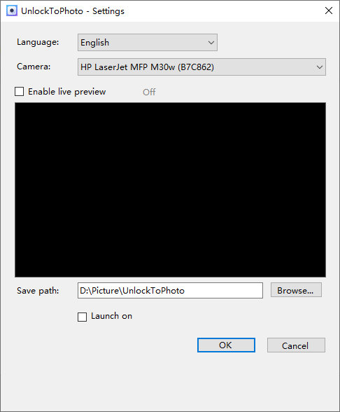

# UnlockToPhoto - Auto Capture on Unlock

A Windows desktop application that automatically takes a photo using your webcam when you unlock your system. Runs silently in the system tray.

**[中文](README.md) | English | [日本語](README_JP.md)**

## Screenshot



## Features

- **Auto Capture on Unlock** — Monitors Windows lock/unlock events and takes a photo automatically after unlock
- **System Tray** — Minimizes to system tray; double-click the tray icon to open settings
- **Camera Selection** — Supports multiple webcams with real device names via WMI
- **Live Preview** — Preview camera feed in settings (off by default, auto-releases on focus loss)
- **Auto Start** — Optionally register to launch on system startup
- **Custom Save Path** — Photos organized in `Year/Month/Day` folders, named `HHmmss.jpg`
- **Installer** — Inno Setup installer with automatic .NET 6 runtime detection

## Use Cases

### 🔒 PC Security Monitoring
Lock your computer when stepping away, then check photos when you return to see if anyone accessed your machine. A zero-cost software alternative to expensive physical surveillance.

### 📸 Daily Self-Record
Enable auto-start and a photo is taken every time you unlock. Over time, it builds a unique "unlock diary" documenting your daily life.

### 🏢 Office Fun
Catch a colleague sneaking onto your computer? Enable UnlockToPhoto and snap the "culprit" next time. Great for lighthearted team interactions.

### 👨‍👩‍👧 Family PC Management
Wondering who's using the family computer? Enable auto-start and get a photo every time someone unlocks — helpful for parents monitoring kids' computer usage.

### 🕵️ Unauthorized Access Evidence
Suspect someone is using your computer without permission? Photos are automatically archived by date, providing a timeline for investigation.

### 🎓 Training / Check-in
Run it on a classroom or meeting room PC — participants unlock the screen and get photographed automatically, serving as a simple attendance aid.

## Tech Stack

- .NET 6 / C# / WinForms
- [OpenCvSharp4](https://github.com/shimat/opencvsharp) — Camera capture
- [System.Management](https://www.nuget.org/packages/System.Management) — WMI device query
- [Inno Setup](https://jrsoftware.org/isinfo.php) — Installer creation

## Project Structure

```
UnlockToPhoto/
├── Program.cs                    # Entry point, camera detection
├── MainForm.cs                   # Main form (hidden) + tray logic
├── MainForm.Designer.cs          # Form designer
├── SettingsForm.cs               # Settings UI (with live preview)
├── UnlockToPhoto.csproj          # Project file
├── Models/
│   └── AppSettings.cs            # Settings model
├── Services/
│   ├── CameraService.cs          # Camera enumeration, capture, preview
│   ├── SettingsManager.cs        # JSON config read/write
│   └── AutoStartManager.cs       # Registry auto-start management
└── icon/
    ├── icon.ico                  # App icon
    ├── icon.png                  # Icon source
    ├── wizard_sidebar.bmp        # Installer wizard sidebar
    └── wizard_header.bmp         # Installer wizard header
```

## Quick Start

### Requirements

- Windows 10/11 (x64)
- [.NET 6 Runtime](https://dotnet.microsoft.com/download/dotnet/6.0)

### Build from Source

```bash
# Clone the repository
git clone https://github.com/sn-mumu/UnlockToPhoto.git
cd UnlockToPhoto

# Add NuGet source (if not configured)
dotnet nuget add source https://api.nuget.org/v3/index.json

# Build
dotnet build

# Run
dotnet run
```

### Publish

```bash
# Framework-dependent (requires .NET 6 on target machine)
dotnet publish -c Release -r win-x64 --self-contained false -o publish

# Self-contained (no .NET 6 required, larger size)
dotnet publish -c Release -r win-x64 --self-contained true -p:PublishSingleFile=true -o publish
```

### Create Installer

```bash
# Requires Inno Setup 6
# Edit file paths in UnlockToPhoto_Setup.iss
# Compile installer
& "C:\Program Files (x86)\Inno Setup 6\ISCC.exe" UnlockToPhoto_Setup.iss
```

## Usage

1. On first launch, the app detects your webcam. If none is found, it prompts to exit
2. The app hides to the system tray after startup
3. Double-click the tray icon to open the settings window
4. Select camera device, save path, and optionally enable live preview
5. Lock your screen and unlock it — the app automatically captures and saves a photo
6. A tray notification appears after each capture

## Configuration

Settings are saved in `%APPDATA%\UnlockToPhoto\settings.json`:

```json
{
  "SavePath": "C:\\Users\\<Username>\\Pictures\\UnlockToPhoto",
  "AutoStart": false,
  "CameraIndex": 0
}
```

| Field | Description | Default |
|-------|-------------|---------|
| `SavePath` | Photo save directory | `Pictures\UnlockToPhoto` |
| `AutoStart` | Launch on startup | `false` |
| `CameraIndex` | Webcam device index | `0` |

## License

MIT License

## Keywords

`Windows` `unlock` `camera` `auto-capture` `webcam` `security` `selfie` `desktop-app` `monitoring` `surveillance` `.NET` `WinForms` `OpenCV` `system-utility` `lock-screen` `photo-capture`