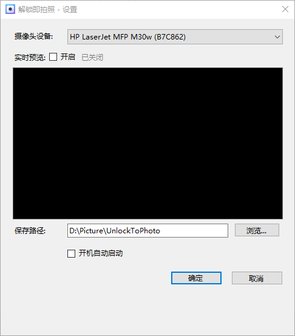

# UnlockToPhoto - ロック解除で自動撮影

Windows システムのロック解除時にウェブカメラで自動的に写真を撮影するデスクトップアプリケーションです。システムトレイでバックグラウンド実行します。

**[中文](README.md) | [English](README_EN.md) | 日本語**

## スクリーンショット



## 機能

- **ロック解除で自動撮影** — Windows のロック/ロック解除イベントを監視し、ロック解除後に自動で写真を撮影
- **システムトレイ常駐** — ウィンドウを閉じるとトレイに隠れ、トレイアイコンをダブルクリックで設定を開く
- **カメラ選択** — WMI で複数のウェブカメラの実際のデバイス名を取得して選択可能
- **ライブプレビュー** — 設定画面でカメラ映像をプレビュー（デフォルトOFF、フォーカス喪失で自動解放）
- **自動起動** — オプションでシステム起動時に自動実行
- **保存パスカスタマイズ** — 写真を `年/月/日` フォルダに整理、ファイル名 `HHmmss.jpg`
- **インストーラー** — .NET 6 ランタイム自動検出付き Inno Setup インストーラー

## 活用シーン

### 🔒 PC セキュリティ監視
席を外す際にパソコンをロックし、戻ってから写真を確認すれば、その間に誰かがPCにアクセスしたかどうかを確認できます。高価な物理監視の代わりに、ゼロコストのソフトウェアソリューションです。

### 📸 毎日のセルフ記録
自動起動を有効にすると、ロック解除のたびに写真が1枚撮影されます。積み重ねることで、ユニークな「ロック解除日記」として毎日の状態や変化を記録できます。

### 🏢 オフィスでの楽しみ
同僚がいない間にあなたのPCを勝手に使っている？UnlockToPhoto を有効にして、次に「犯人」を捕まえましょう。チームの轻松的な交流に最適です。

### 👨‍👩‍👧 家庭のPC管理
家庭のパソコンを誰が使っているか知りたい？自動起動を有効にして、ロック解除のたびに自動撮影 — お子様のパソコン利用状況を把握するのに役立ちます。

### 🕵️ 不正アクセスの証拠
誰かが勝手にあなたのパソコンを使っている疑いがある場合、写真は日付別に自動整理され、調査のためのタイムラインを提供します。

### 🎓 研修 / 出席管理
研修教室や会議室のPCで実行すれば、参加者が画面のロックを解除するだけで自動撮影され、簡易的な出席記録の補助手段として利用できます。

## 技術スタック

- .NET 6 / C# / WinForms
- [OpenCvSharp4](https://github.com/shimat/opencvsharp) — カメラキャプチャ
- [System.Management](https://www.nuget.org/packages/System.Management) — WMI デバイスクエリ
- [Inno Setup](https://jrsoftware.org/isinfo.php) — インストーラー作成

## プロジェクト構成

```
UnlockToPhoto/
├── Program.cs                    # エントリーポイント、カメラ検出
├── MainForm.cs                   # メインフォーム（非表示）+ トレイロジック
├── MainForm.Designer.cs          # フォームデザイナー
├── SettingsForm.cs               # 設定画面（ライブプレビュー付き）
├── UnlockToPhoto.csproj          # プロジェクトファイル
├── Models/
│   └── AppSettings.cs            # 設定モデル
├── Services/
│   ├── CameraService.cs          # カメラ列挙、キャプチャ、プレビュー
│   ├── SettingsManager.cs        # JSON 設定の読み書き
│   └── AutoStartManager.cs       # レジストリ自動起動管理
└── icon/
    ├── icon.ico                  # アプリアイコン
    ├── icon.png                  # アイコンソース
    ├── wizard_sidebar.bmp        # インストーラーウィザードサイドバー
    └── wizard_header.bmp         # インストーラーウィザードヘッダー
```

## クイックスタート

### 動作環境

- Windows 10/11 (x64)
- [.NET 6 ランタイム](https://dotnet.microsoft.com/download/dotnet/6.0)

### ソースからビルド

```bash
# リポジトリをクローン
git clone https://github.com/sn-mumu/UnlockToPhoto.git
cd UnlockToPhoto

# NuGet ソースを追加（未設定の場合）
dotnet nuget add source https://api.nuget.org/v3/index.json

# ビルド
dotnet build

# 実行
dotnet run
```

### パブリッシュ

```bash
# フレームワーク依存モード（ターゲットマシンに .NET 6 が必要）
dotnet publish -c Release -r win-x64 --self-contained false -o publish

# 自己完結モード（.NET 6 不要、サイズは大きい）
dotnet publish -c Release -r win-x64 --self-contained true -p:PublishSingleFile=true -o publish
```

### インストーラーの作成

```bash
# Inno Setup 6 が必要
# UnlockToPhoto_Setup.iss のファイルパスを編集
# インストーラーをコンパイル
& "C:\Program Files (x86)\Inno Setup 6\ISCC.exe" UnlockToPhoto_Setup.iss
```

## 使い方

1. 初回起動時にウェブカメラを検出します。見つからない場合は終了を促します
2. 起動後、自動的にシステムトレイに隠れます
3. トレイアイコンをダブルクリックして設定画面を開きます
4. カメラデバイス、保存パスを選択し、ライブプレビューを有効にできます
5. 画面をロックしてロック解除すると、アプリが自動的に写真を撮影して保存します
6. 撮影完了後、トレイに通知が表示されます

## 設定

設定ファイルは `%APPDATA%\UnlockToPhoto\settings.json` に保存されます：

```json
{
  "SavePath": "C:\\Users\\<ユーザー名>\\Pictures\\UnlockToPhoto",
  "AutoStart": false,
  "CameraIndex": 0
}
```

| フィールド | 説明 | デフォルト |
|-----------|------|-----------|
| `SavePath` | 写真の保存ディレクトリ | `Pictures\UnlockToPhoto` |
| `AutoStart` | 起動時に自動実行 | `false` |
| `CameraIndex` | ウェブカメラのデバイスインデックス | `0` |

## ライセンス

MIT License

## キーワード

`Windows` `ロック解除` `自動撮影` `ウェブカメラ` `セキュリティ` `セルフィー` `デスクトップアプリ` `監視` `.NET` `WinForms` `OpenCV` `システムツール` `unlock` `camera` `auto-capture` `webcam` `security` `selfie` `desktop-app` `lock-screen`